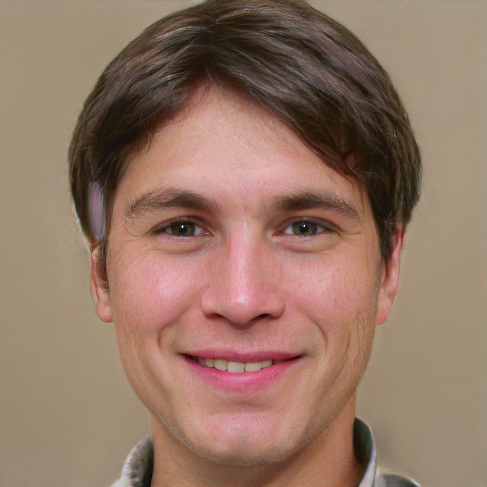
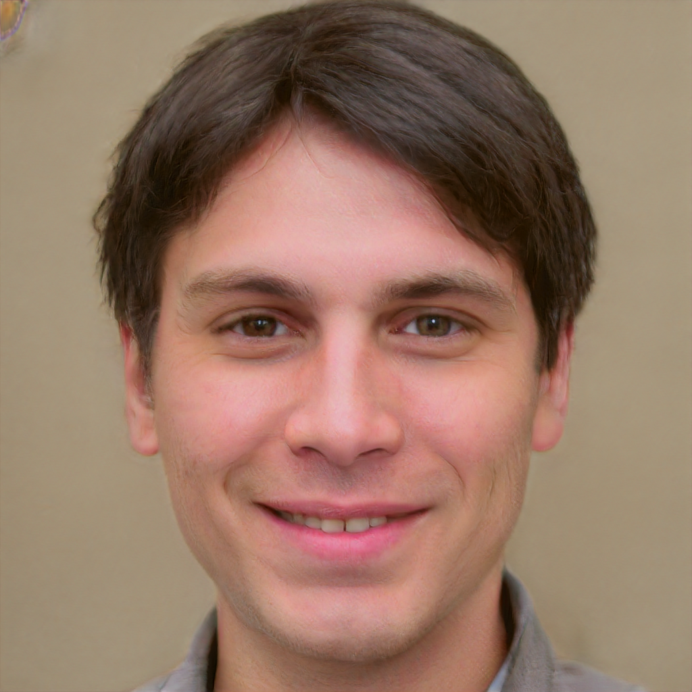
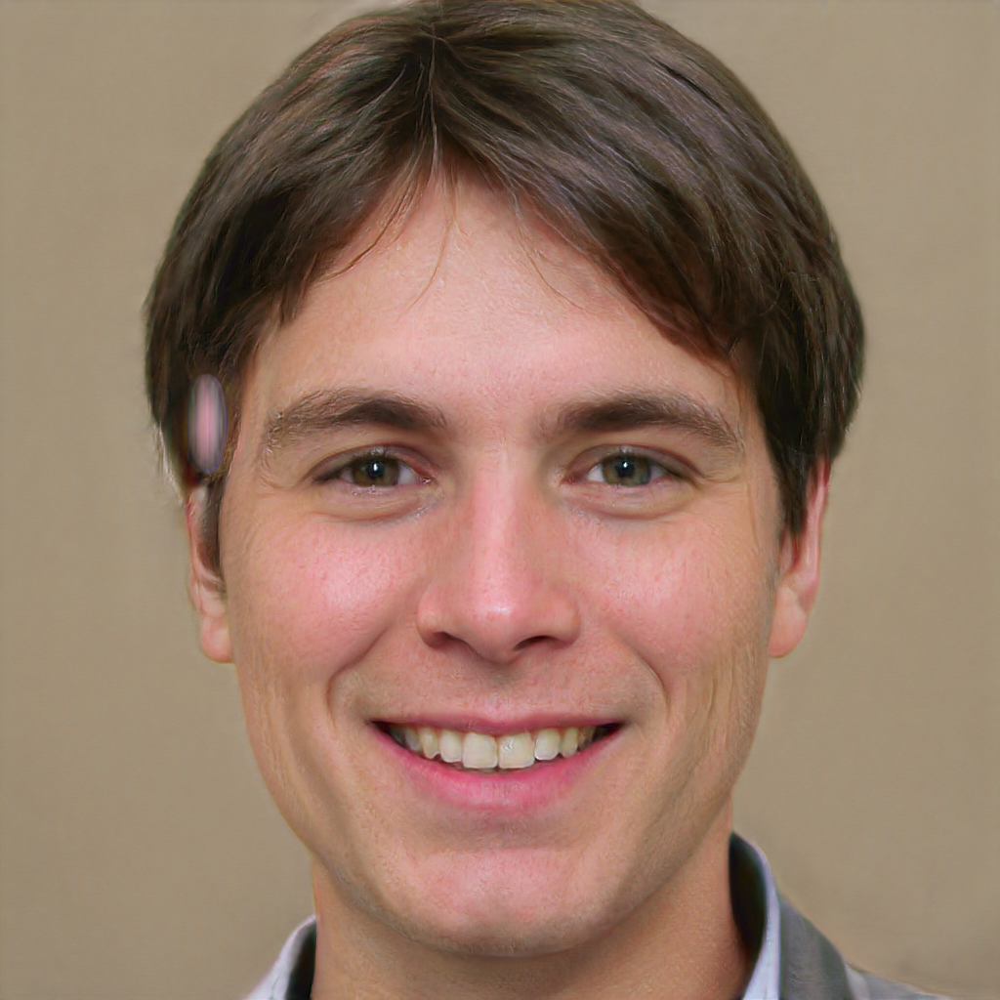
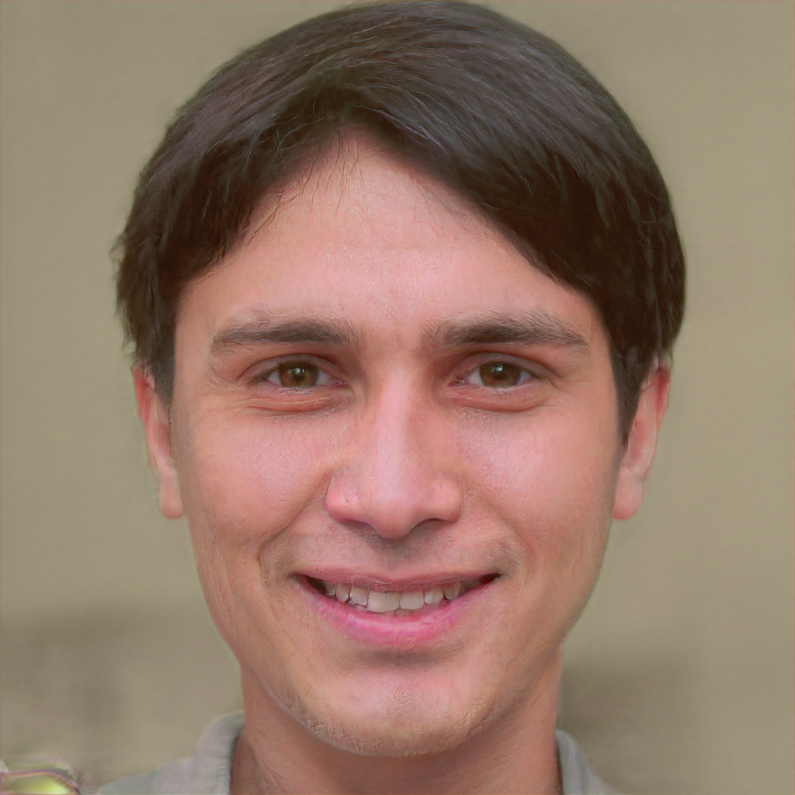
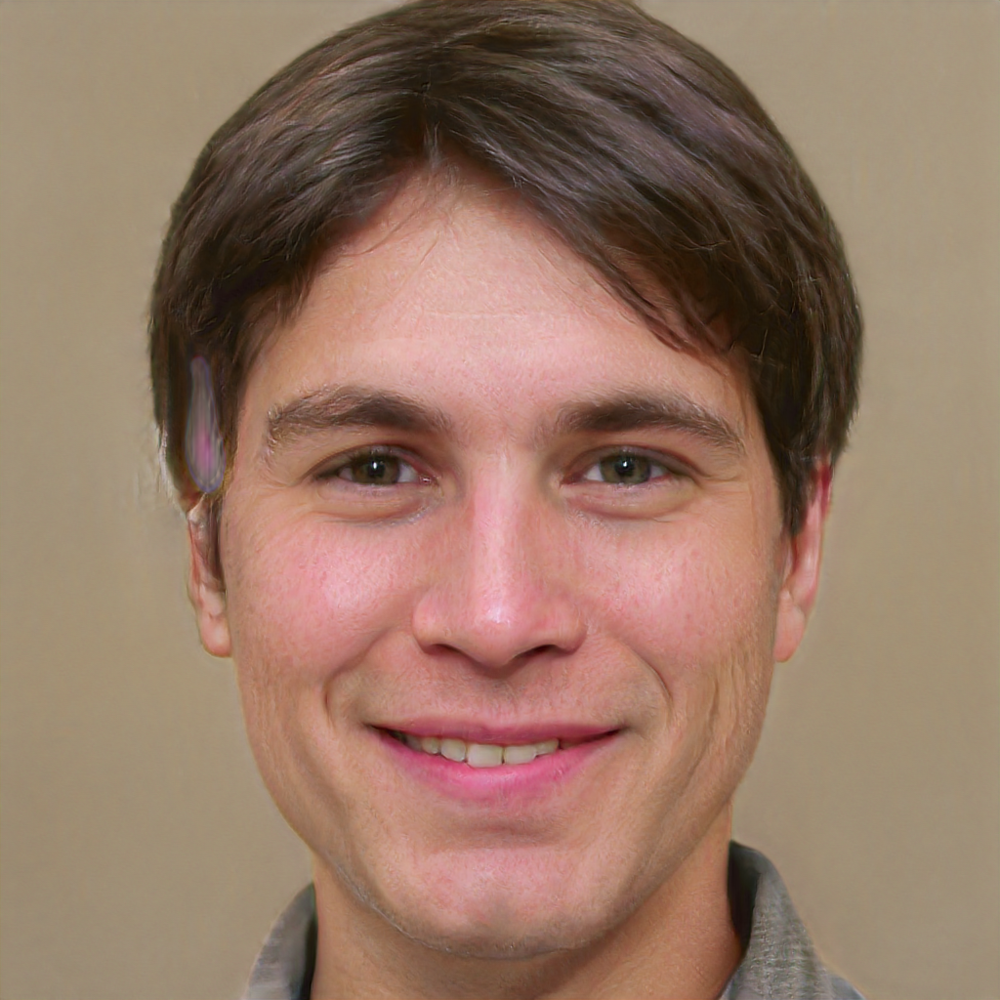
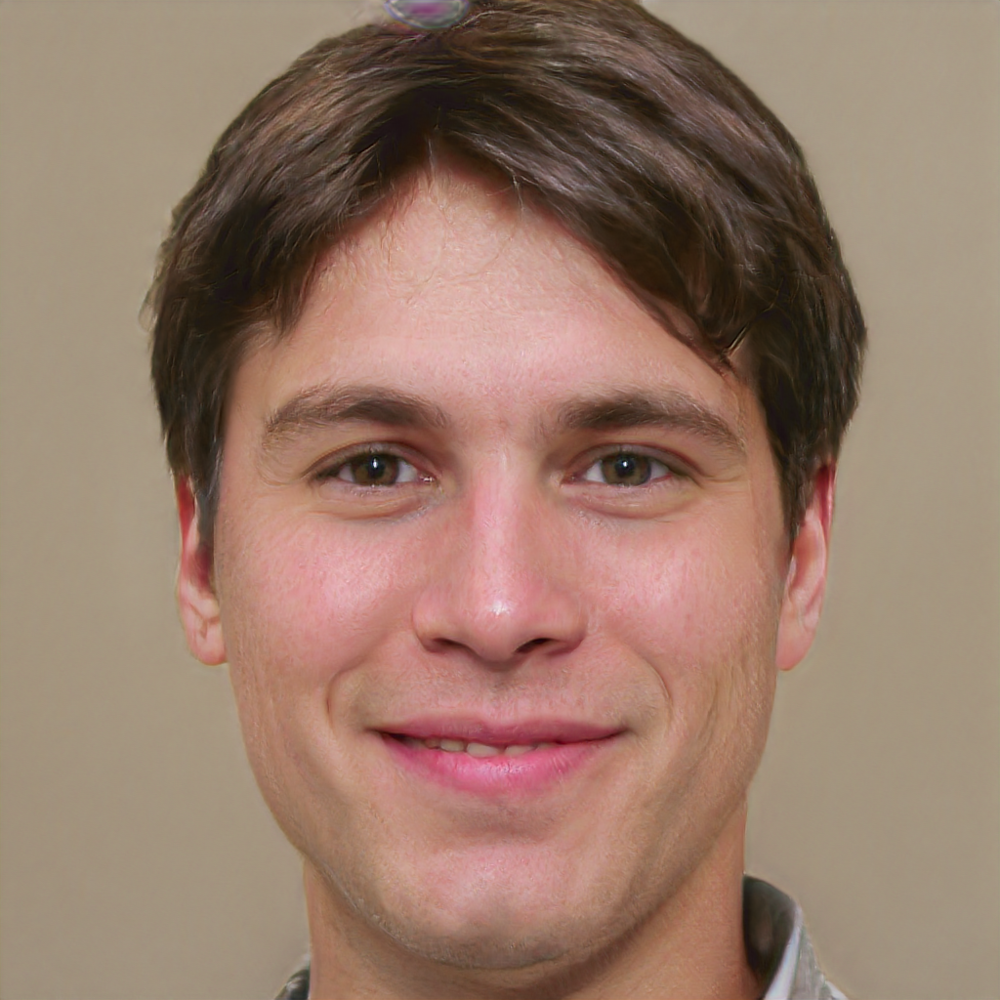
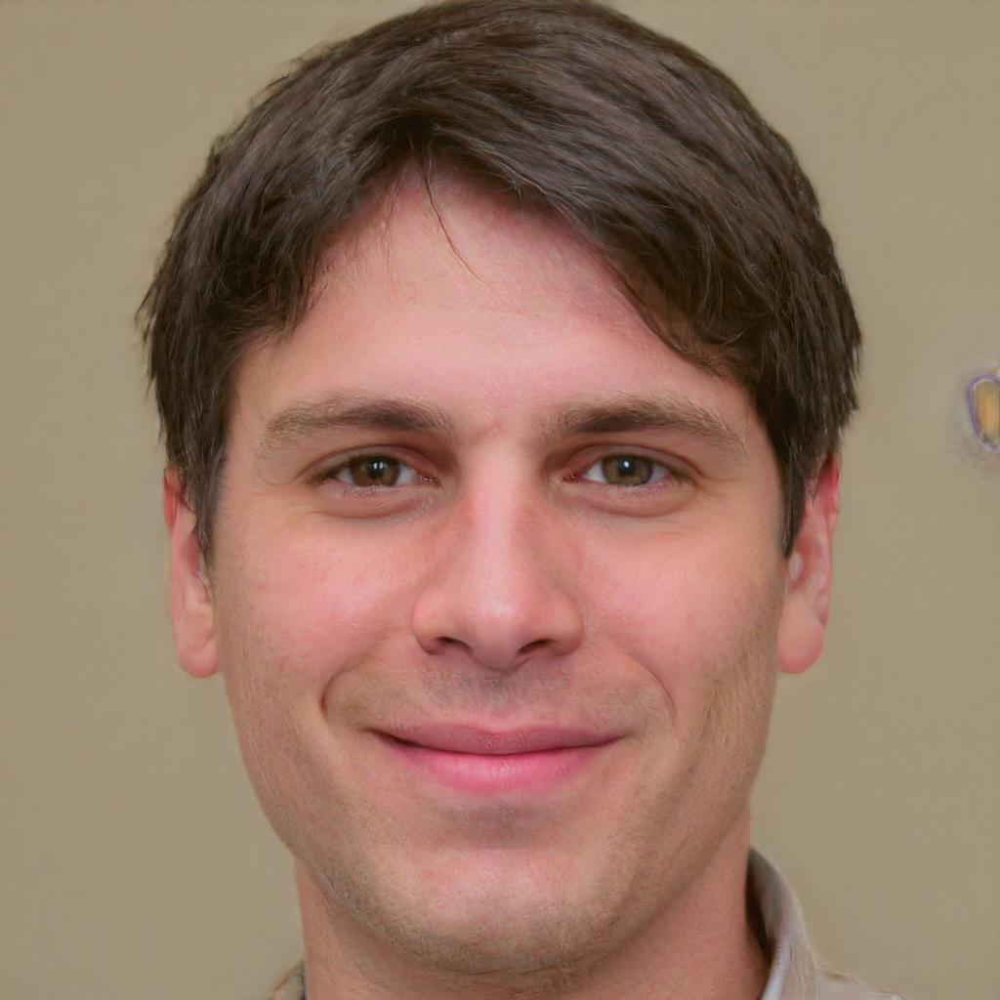
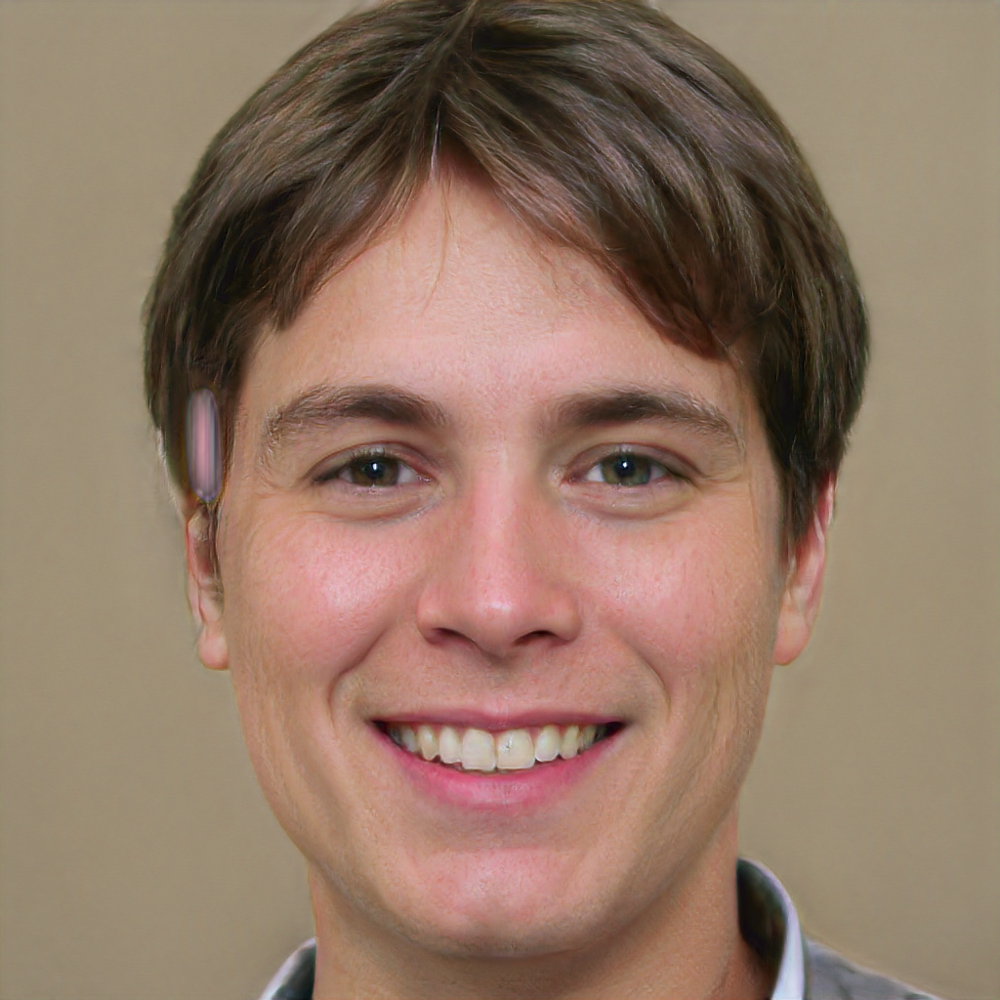
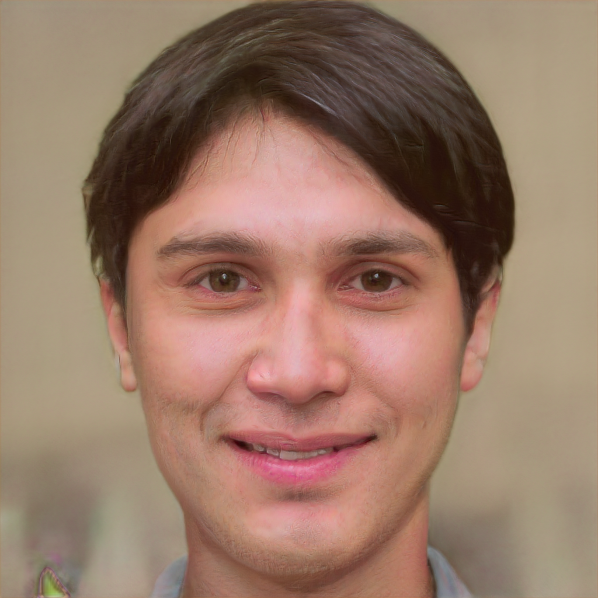
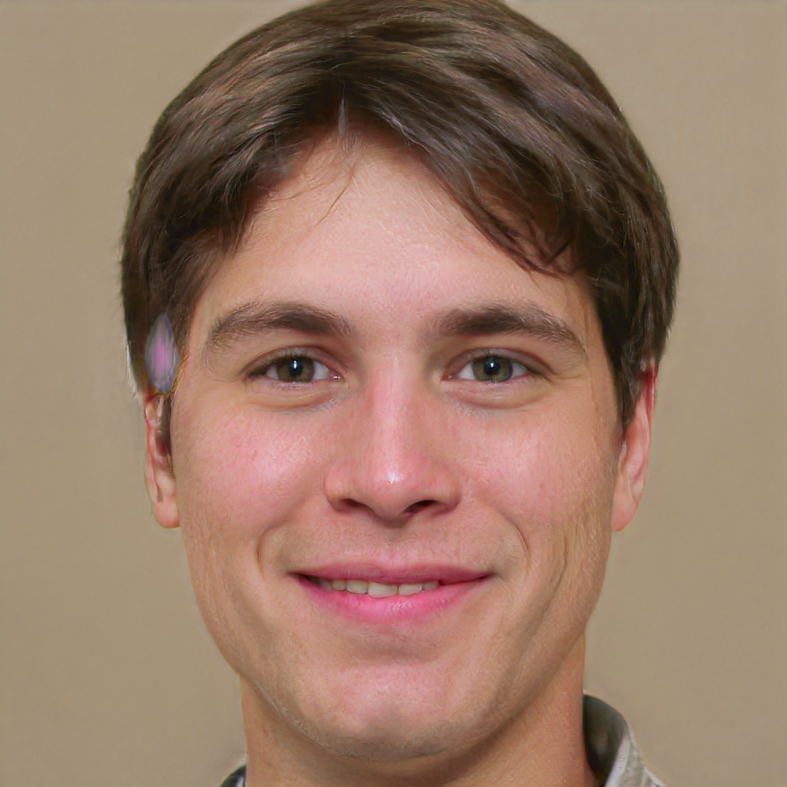

# PULSE: Self-Supervised Photo Upsampling via Latent Space Exploration of Generative Models

Code accompanying CVPR'20 paper of the same title. Paper: [arXiv:2003.03808](https://arxiv.org/abs/2003.03808) ([CVPR open-access PDF](https://openaccess.thecvf.com/content_CVPR_2020/papers/Menon_PULSE_Self-Supervised_Photo_Upsampling_via_Latent_Space_Exploration_of_Generative_CVPR_2020_paper.pdf))

## NOTE

The original authors noted concern that PULSE would be used to identify individuals whose faces have been blurred out, and emphasized that this is impossible - **PULSE makes imaginary faces of people who do not exist, which should not be confused for real people.** It will **not** help identify or reconstruct the original image.

They also addressed concerns of bias in PULSE: **the [paper](https://arxiv.org/abs/2003.03808) includes a section, along with an accompanying model card, directly addressing this bias.**

---

## Fork notes

This fork updates the original CVPR'20 code so it runs on modern hardware and without the (now-defunct) hosted model weights:

- **Runs on CUDA, Apple Silicon (MPS/Metal), or CPU** — the device is auto-selected by `device.py`; no code changes needed. Force one with `PULSE_DEVICE=cpu` (or `mps`/`cuda`).
- **Loads model weights from local files** (`synthesis.pt`, `mapping.pt`, `shape_predictor_68_face_landmarks.dat`) when present in the repo root, falling back to download only if they're missing. The original Google Drive and self-hosted download links are no longer live, so place these files in the repo root yourself. `shape_predictor_68_face_landmarks.dat` is the stock dlib model (`http://dlib.net/files/shape_predictor_68_face_landmarks.dat.bz2`).
- `pulse.yml` is modernized to PyTorch 2.x (the same torch used for the MPS path), Python 3.13, and only the packages the code actually uses.


# Table of Contents

- [PULSE: Self-Supervised Photo Upsampling via Latent Space Exploration of Generative Models](#pulse-self-supervised-photo-upsampling-via-latent-space-exploration-of-generative-models)
- [Table of Contents](#table-of-contents)
  - [Fork notes](#fork-notes)
  - [What does it do?](#what-does-it-do)
  - [Usage](#usage)
    - [Prereqs](#prereqs)
    - [Data](#data)
    - [Applying PULSE](#applying-pulse)
    - [Command-line reference](#command-line-reference)
    - [What is latent space?](#what-is-latent-space)
    - [Understanding the key parameters](#understanding-the-key-parameters)
    - [Parameter sweep (worked example)](#parameter-sweep-worked-example)

## What does it do?

In plain terms: you give PULSE a small, blurry photo of a face, and it invents a sharp, realistic face that — when shrunk back down to the size of your blurry one — looks just like your input. It does not _recover_ detail that was lost in the blur (that information is gone for good); it _imagines_ a believable high-res face that is consistent with the blur. That is also why two runs can hand you two different people who both shrink down to the same photo.

More precisely: given a low-resolution input image, PULSE searches the outputs of a generative model (here, [StyleGAN](https://github.com/NVlabs/stylegan)) for high-resolution images that are perceptually realistic and downscale correctly.


## Usage

The main file of interest for applying PULSE is `run.py`. A full list of arguments with descriptions can be found in that file; the ones relevant to getting started are described below.

### Prereqs

Before your first run you need three things in place: one system tool, the Python environment, and the pretrained model files.

1. **Install `cmake`.** It's needed to build `dlib`, the library that finds and straightens faces (on a Mac: `brew install cmake`; on Debian/Ubuntu: `apt install cmake`).
2. **Create the Python environment** from the provided file. This fork runs on an NVIDIA GPU (CUDA), Apple Silicon (MPS), or a plain CPU — the right one is picked automatically (see [Fork notes](#fork-notes)); the original only supported CUDA and was tested on Linux and Windows.

   ```bash
   conda env create -n pulse -f pulse.yml
   conda activate pulse
   ```

3. **Put the pretrained model files in the repo root:** `synthesis.pt`, `mapping.pt`, and `shape_predictor_68_face_landmarks.dat`. These are the trained "brain" of the model — without them nothing can run — and the code loads them directly when they're present. The original auto-download links (Google Drive, and a later mirror) are no longer live, so you'll need to obtain the files yourself. `shape_predictor_68_face_landmarks.dat` is the stock dlib model from `http://dlib.net/files/shape_predictor_68_face_landmarks.dat.bz2`. (To restore auto-download, edit the URLs in `PULSE.py` and `align_face.py` to point at a host you control.)

### Data

`run.py` reads its inputs from `./input/` by default, and it expects each image to already be a square, face-aligned, low-resolution PNG. If your photos aren't in that form yet, don't worry — put the originals in `realpics/` and run `align_face.py` first. It locates the face, crops and straightens it, and shrinks it down for you (you pick the downscaling factor at this step). As before, any of these directories can be changed with a command-line argument.

One gotcha: if a photo is _already_ low-resolution, shrinking it further throws away almost all the detail that's left. In that case, bicubically upscale it first (usually to 1024×1024) and let `align_face.py` handle the downscaling.

The original authors tested on the [CelebA-HQ](https://github.com/tkarras/progressive_growing_of_gans) face dataset, but in their experience PULSE works on just about any photo of a realistic face.

### Applying PULSE

Once your data is appropriately formatted, all you need to do is

```bash
python run.py
```

Enjoy!

> _Any resemblance to actual persons, living or dead, is purely coincidental — and also mathematically the whole point._

### Command-line reference

All directories and hyperparameters are command-line arguments. The tables below are generated from the `argparse` definitions at the top of each script (`python run.py -h` / `python align_face.py -h` print the same descriptions).

**`run.py`** — super-resolve every `*.png` in the input dir:

| Argument                      | Default                | Description                                                                            |
| ----------------------------- | ---------------------- | -------------------------------------------------------------------------------------- |
| `-input_dir`                  | `input`                | input data directory                                                                   |
| `-output_dir`                 | `runs`                 | output data directory                                                                  |
| `-cache_dir`                  | `cache`                | cache directory for model weights                                                      |
| `-duplicates`                 | `1`                    | how many HR images to produce for every image in the input directory                   |
| `-batch_size`                 | `1`                    | batch size to use during optimization                                                  |
| `-seed`                       | _(none)_               | manual seed to use                                                                     |
| `-loss_str`                   | `100*L2+0.05*GEOCROSS` | loss function to use (weighted terms: `L2`, `L1`, `GEOCROSS`)                          |
| `-eps`                        | `2e-3`                 | target for the downscaling loss (L2); optimization stops contributing once within this |
| `-noise_type`                 | `trainable`            | `zero`, `fixed`, or `trainable`                                                        |
| `-num_trainable_noise_layers` | `5`                    | number of noise layers to optimize                                                     |
| `-tile_latent`                | `False` (flag)         | forcibly tile the same latent 18 times                                                 |
| `-bad_noise_layers`           | `17`                   | noise layers to zero out to improve image quality (split on `.`, e.g. `3.5`)           |
| `-opt_name`                   | `adam`                 | optimizer for projected gradient descent (`sgd`, `adam`, `sgdm`, `adamax`)             |
| `-learning_rate`              | `0.4`                  | learning rate to use during optimization                                               |
| `-steps`                      | `100`                  | number of optimization steps                                                           |
| `-lr_schedule`                | `linear1cycledrop`     | `fixed`, `linear1cycledrop`, or `linear1cycle`                                         |
| `-save_intermediate`          | `False` (flag)         | store and save intermediate HR and LR images during optimization                       |

**`align_face.py`** — (optional preprocessing) align + downscale raw photos:

| Argument       | Default    | Description                                                 |
| -------------- | ---------- | ----------------------------------------------------------- |
| `-input_dir`   | `realpics` | directory with unprocessed images                           |
| `-output_dir`  | `input`    | output directory                                            |
| `-output_size` | `32`       | size to downscale the input images to, must be a power of 2 |
| `-seed`        | _(none)_   | manual seed to use                                          |
| `-cache_dir`   | `cache`    | cache directory for model weights                           |

### What is latent space?

"Latent space" comes up constantly below, so here's the intuition. A generator like [StyleGAN](https://github.com/NVlabs/stylegan) is just a function that turns a short list of numbers into an image:

```text
latent vector  →  StyleGAN  →  image
 (512 numbers)                 (1024×1024 face)
```

The **latent space** is the space of all possible input vectors. Every point in it maps to some output face, and moving around in it moves you smoothly between faces. It's "latent" (hidden) because those numbers aren't pixels — they're an abstract code the network learned to expand into a full picture.

A useful analogy is a music synthesizer: you don't draw the sound wave directly, you turn a few dozen knobs and the synth produces audio. The space of all knob settings is its latent space. StyleGAN is the same idea for faces — hand it ~512 "knob" numbers and it renders a photorealistic face; nudge them and the face changes smoothly (older, smiling, different hair).

The reason this is useful is that a trained GAN's latent space is **organized**, not random:

- **Nearby points → similar images**, so you can interpolate and use gradient descent to slide toward a target.
- **Directions carry meaning** — one direction adds a smile, another rotates the head, another ages the face.
- **Realistic faces occupy a thin region** (a curved surface, or _manifold_) inside the space; points on it look like faces, points far off it look like noise.

This is exactly what PULSE exploits: it freezes StyleGAN and **searches the latent space** for an input whose output downscales onto your photo (relying on smoothness for the search), while constraining that search to stay on the realistic-face manifold (so the result is a believable face, not noise that happens to downscale right).

StyleGAN actually exposes a few latent spaces, which is what [`-tile_latent`](#understanding-the-key-parameters) toggles between: a raw **Z** vector, a more disentangled **W** vector (Z run through a mapping network), and **W+** — 18 separate W vectors, one per layer, where coarse layers control pose/shape and fine layers control texture/color. PULSE optimizes all 18 (W+) by default for maximum expressiveness; `-tile_latent` collapses them back to a single shared W.

### Understanding the key parameters

The table above says _what_ each flag is; this section explains _why_ the interesting ones exist. First, a mental model.

PULSE never "enhances" your photo directly. It holds a pretrained [StyleGAN](https://github.com/NVlabs/stylegan) generator **fixed** and **searches its latent space** — the space of all faces the GAN can draw — for a high-res face that, when bicubically shrunk back down, lands on your low-res input. The search is ordinary gradient descent, but over the generator's _input_ (a latent vector plus some noise) rather than over any network weights. Two competing forces pull on that search:

1. **"Downscale correctly"** — the generated face, shrunk, must match your LR image. (the `L2`/`L1` loss terms)
2. **"Stay a realistic face"** — the latent must stay in the region StyleGAN considers natural, so you get a believable face and not random noise that happens to downscale right. (the spherical constraint + the `GEOCROSS` term)

Most of the non-obvious flags are knobs on that balance.

- **`-loss_str`** — the objective itself, written as `weight*TERM+weight*TERM`. The default `100*L2+0.05*GEOCROSS` means "mostly match the downscaled pixels, with a light realism nudge." Terms:
  - **`L2` / `L1`** — distance between the **downscaled** generated image and your input — the "downscales correctly" force. `L1` tolerates outlier pixels more than `L2`.
  - **`GEOCROSS`** — a _geodesic cross_ penalty. The latent is really 18 separate 512-d style vectors (one per StyleGAN layer); `GEOCROSS` measures how far apart they sit on the sphere and penalizes spreading them out. Keeping them together ties the result to StyleGAN's natural faces (more realistic); a smaller weight allows more per-layer detail but risks artifacts.
- **`-eps`** (default `2e-3`) — a "good enough" floor on the downscaling loss. Once the per-image match is within `eps`, that term stops pushing, so the optimizer doesn't keep chasing exact LR pixels at the expense of realism. Lower = stricter match, higher = more creative license.
- **`-noise_type`** + **`-num_trainable_noise_layers`** — StyleGAN injects tiny per-pixel "noise" at each layer to render fine texture (pores, stray hairs). `zero` ignores it, `fixed` picks a random texture and freezes it, `trainable` optimizes it too. With `trainable`, `-num_trainable_noise_layers` (default 5) sets how many layers — coarsest first — get optimized: more layers = more freedom to match detail, more chance of cheating realism.
- **`-bad_noise_layers`** (default `"17"`) — specific noise layers forced to zero because their high-frequency content tends to add artifacts. **This list is split on `.`** (e.g. `"3.5"`), not commas.
- **`-tile_latent`** — off by default. **Off**, the 18 style vectors are optimized independently (StyleGAN's expressive "W+" space). **On**, a single vector is tiled to all 18 layers (the tighter "W" space — more constrained, sometimes more stable).
- **`-opt_name` / `-learning_rate` / `-steps` / `-lr_schedule`** — standard gradient-descent controls: which optimizer (`adam` default; also `sgd`, `sgdm`, `adamax`), the step size, how many iterations, and how the learning rate ramps across them (`linear1cycledrop` warms up then decays, then drops at the end). On top of these, every parameter is projected back onto a fixed-radius sphere after each step — the paper's key "Riemannian" trick that keeps the search on the realistic manifold.
- **`-duplicates`** — because the problem is underdetermined (many faces downscale to the same blur), each run from a fresh random start finds a _different_ valid face. `-duplicates 3` gives you three to pick from; **`-seed`** instead fixes the random start for reproducibility.

For the full story, see the [PULSE paper](https://arxiv.org/abs/2003.03808) — especially the section on the latent-space search and the spherical prior — and the [StyleGAN paper](https://arxiv.org/abs/1812.04948) for what the latent and noise inputs (and the W / W+ spaces) actually are.

### Parameter sweep (worked example)

To make the knobs above concrete, here is the same input (`input/demo.png`) super-resolved five times. Every run uses `-seed 42 -steps 100` so the random starting latent is **identical** — the only thing changing is the one parameter noted, so any difference in the output is attributable to that parameter. Outputs are in [`readme_resources/experiments/`](readme_resources/experiments).

| Output              | Command (all share `-seed 42 -steps 100`)       | What's different                                              | Final `L2` | Final `GEOCROSS` | Converged |
| ------------------- | ----------------------------------------------- | ------------------------------------------------------------- | ---------- | ---------------- | --------- |
| `baseline.png`      | `python run.py`                                 | defaults (`100*L2+0.05*GEOCROSS`, `noise_type trainable`, W+) | `0.0020`   | `0.566`          | step 100  |
| `tile_latent.png`   | `python run.py -tile_latent`                    | one shared latent (W space) instead of 18 (W+)                | `0.0020`   | `0.000`          | step 45   |
| `geocross_high.png` | `python run.py -loss_str "100*L2+1.0*GEOCROSS"` | 20× stronger realism/spread penalty                           | `0.0020`   | `0.030`          | step 100  |
| `no_geocross.png`   | `python run.py -loss_str "100*L2"`              | realism penalty removed entirely                              | `0.0020`   | _(n/a)_          | step 27   |
| `noise_fixed.png`   | `python run.py -noise_type fixed`               | noise frozen at random init, not optimized                    | `0.0020`   | `0.659`          | step 100  |

| baseline                                                 | tile_latent                                                    | geocross_high                                                      | no_geocross                                                    | noise_fixed                                                    |
| -------------------------------------------------------- | -------------------------------------------------------------- | ------------------------------------------------------------------ | -------------------------------------------------------------- | -------------------------------------------------------------- |
|  |  |  |  |  |

Things to notice, tying back to the explanations above:

- **All five reach the same `L2` (`0.0020`).** Every variant is a genuinely valid solution — each downscales onto the input equally well. This is the underdetermined-problem point: the parameters don't change _whether_ it matches, they change _which_ realistic face you land on while matching.
- **`GEOCROSS` behaves exactly as described.** `tile_latent` drives it to `0.000` (with one shared latent there is no spread between the 18 vectors to penalize), `geocross_high` squeezes the 18 vectors tightly together (`0.030`), and `no_geocross` drops the term entirely.
- **Removing the realism term converges fastest** (`no_geocross` at step 27) because the optimizer only has to satisfy the pixel match — but that is also the configuration most free to drift off the realistic-face manifold on a harder input.
- Differences here are subtle because `demo.png` is an easy input that every setting solves comfortably; on lower-quality or more ambiguous inputs these knobs separate much more dramatically — which is exactly what the next example shows.

#### The same sweep on a harder input

`input/demo2.png` is the same face shrunk to a tiny **16×16**, so PULSE has to invent a 1024×1024 result from 1/4 as many pixels — a **64× upscale** (PULSE's headline case from the paper) instead of 32×. With so little to pin the answer down, the search has far more freedom, and the parameters now move the result much more.

| Output                    | What's different                  | Final `L2` | Final `GEOCROSS` | Converged |
| ------------------------- | --------------------------------- | ---------- | ---------------- | --------- |
| `demo2_baseline.png`      | defaults                          | `0.0020`   | `0.608`          | step 100  |
| `demo2_tile_latent.png`   | `-tile_latent` (W space)          | `0.0020`   | `0.000`          | step 28   |
| `demo2_geocross_high.png` | `-loss_str "100*L2+1.0*GEOCROSS"` | `0.0020`   | `0.027`          | step 100  |
| `demo2_no_geocross.png`   | `-loss_str "100*L2"`              | `0.0020`   | _(n/a)_          | step 20   |
| `demo2_noise_fixed.png`   | `-noise_type fixed`               | `0.0020`   | `0.574`          | step 100  |

| baseline                                                             | tile_latent                                                                | geocross_high                                                                  | no_geocross                                                                | noise_fixed                                                                |
| -------------------------------------------------------------------- | -------------------------------------------------------------------------- | ------------------------------------------------------------------------------ | -------------------------------------------------------------------------- | -------------------------------------------------------------------------- |
|  |  |  |  |  |

Every variant still reaches the same `L2` (`0.0020`) — they all downscale onto the input equally well — but now they clearly disagree about _who the person is_: `tile_latent` and `no_geocross` settle on a noticeably darker-haired, warmer-toned face, while the others stay lighter. Same blurry input, same starting latent, different knobs → different believable people. That gap between "matches the pixels" and "which face you get" is the whole point of PULSE, and it widens as the input gets harder.
