# Tuning

← [back to the README](../README.md)

If you only read one page of these docs, make it this one.

Everything here was measured on an M4 Max with multiple seeds per cell, scored on the thing PULSE is actually trying to minimize: **the L2 distance between the saved image, shrunk back down, and your input.** Lower is better. The optimization is chaotic — a single run tells you almost nothing — so nothing below rests on one sample.

---

## The headline: `-steps` is too low, and it isn't close

The default is `-steps 100`. That's plenty for an easy photo and **badly** short for a hard one.

| input          | 100 steps | 200                | 400     | 800                | GEOCROSS 100 → 800 |
| -------------- | --------- | ------------------ | ------- | ------------------ | ------------------ |
| `demo` (easy)  | 0.00143   | 0.00136            | 0.00136 | 0.00135 (−5%)      | 0.48 → 0.04        |
| `demo3` (hard) | 0.00402   | **0.00199 (−50%)** | 0.00200 | 0.00201            | 10.45 → 1.44       |
| `demo5` (hard) | 0.00672   | 0.00363            | 0.00222 | **0.00201 (−70%)** | 6.59 → 1.93        |

`demo3` **halves its error** by running 200 steps instead of 100. `demo5` needs about 800. The easy input was already finished at 100 and gains nothing from more.

Put that next to the performance work. Every Apple-Silicon optimization in this repo — the faster upsample, the removed host sync, the compiled generator, half precision — is worth about **8% put together**. Changing one number is worth **50%**.

**That is the whole lesson.** The speed work matters because it makes more steps affordable. It was never the prize.

And this isn't a metric being gamed: notice that `GEOCROSS` — the realism term — improves _alongside_ `L2` (10.45 → 1.44). The extra steps are not buying pixel accuracy by wandering off the manifold of real faces. Both objectives get better together. The faces get **more** plausible, not less.

### What convergence actually looks like

Look at the plateau: `demo3` lands on 0.00199, then 0.00200, then 0.00201. Dead flat at `0.0020`.

That's not a coincidence, and it's not the optimizer giving up. **`L2` is clamped at `-eps`** (default `2e-3`). Once the match is close enough, that term stops pushing — by design, so the search doesn't spend its last hundred steps chasing pixel decimals at the cost of realism. So the loss can never go _below_ `eps`.

**Sitting on that floor is what convergence looks like.** Reaching `0.0020` means "done," not "stuck."

Which means the interesting question is what happens when a run _doesn't_ get there. It now says so:

```
BEST (100) | L2: 0.0067 | GEOCROSS: 7.6394 | TOTAL: 1.0524 | time: 4.7 | it/s: 21.09
  NOT CONVERGED: best L2 0.00670 > eps 0.002 after 100 steps (still improving). Raise -steps (try 200).
```

If you see that, the face you got back does **not** downscale onto your input as closely as you asked. The search was still descending when the step counter ran out. It isn't broken — it's unfinished. Raise `-steps` until the line goes away.

The default stays at 100, because raising it would silently double everyone's runtime and change everyone's outputs. You get told instead.

### Two related findings

- **Don't switch `-lr_schedule` to `fixed`.** At 400 steps on `demo5`, `fixed` is **65% worse** than the default `linear1cycledrop`. The mid-run learning-rate ramp looks wasteful — it deliberately _un-converges_ you halfway through — and it earns its keep anyway. (It's also why the loss is non-monotone, and why the best step is so often not the last one.)
- **`-learning_rate 0.8`** (vs. the default `0.4`) helps hard inputs by roughly 8–10% and costs nothing on easy ones. Worth trying; not made the default on the strength of two seeds.

---

## Worked example: one photo, five settings

Here is `input/demo.png` super-resolved five times. Every run shares `-seed 42 -steps 100`, so the random starting latent is **identical**. Exactly one parameter changes per row, which means any difference you see is attributable to that parameter and nothing else.

| Output          | Command (all share `-seed 42 -steps 100`) | What's different                         | `L2`     | `GEOCROSS` | Best step |
| --------------- | ----------------------------------------- | ---------------------------------------- | -------- | ---------- | --------- |
| `baseline`      | `python run.py`                           | the defaults                             | `0.0020` | `0.523`    | 100       |
| `tile_latent`   | `-tile_latent`                            | one shared latent (W) instead of 18 (W+) | `0.0020` | `0.000`    | 45        |
| `geocross_high` | `-loss_str "100*L2+1.0*GEOCROSS"`         | 20× stronger realism penalty             | `0.0020` | `0.030`    | 100       |
| `no_geocross`   | `-loss_str "100*L2"`                      | realism penalty deleted entirely         | `0.0020` | _(n/a)_    | 27        |
| `noise_fixed`   | `-noise_type fixed`                       | noise frozen at random init              | `0.0020` | `0.852`    | 100       |

| baseline                                                                            | tile_latent                                                                               | geocross_high                                                                                 | no_geocross                                                                               | noise_fixed                                                                               |
| ----------------------------------------------------------------------------------- | ----------------------------------------------------------------------------------------- | --------------------------------------------------------------------------------------------- | ----------------------------------------------------------------------------------------- | ----------------------------------------------------------------------------------------- |
|  |  |  |  |  |

What to notice:

- **All five reach the same `L2`.** Every one of them is a genuinely valid answer — each shrinks back onto the input equally well. This is the underdetermined problem in a table: the parameters don't change _whether_ you match, they change _which_ face you land on while matching.
- **`GEOCROSS` behaves exactly as advertised.** `tile_latent` drives it to `0.000` (with one shared latent there's no spread between the 18 vectors to penalize). `geocross_high` squeezes them together (`0.030`). `no_geocross` deletes the term.
- **Deleting the realism term converges fastest** — `no_geocross` is done by step 27 — because the optimizer only has one job. Hold that thought.
- The differences here are subtle, because `demo.png` is an easy input that every setting solves comfortably. Which is exactly why the next example exists.

---

## The same sweep, on a harder input

`input/demo2.png` is the same face shrunk to **16×16** — a **64× upscale**, PULSE's headline case from the paper, from a quarter as many pixels. With that little to pin the answer down, the search has enormously more freedom, and the knobs start to matter.

| Output                | What's different                  | `L2`     | `GEOCROSS` | Best step |
| --------------------- | --------------------------------- | -------- | ---------- | --------- |
| `demo2_baseline`      | the defaults                      | `0.0020` | `0.523`    | 100       |
| `demo2_tile_latent`   | `-tile_latent` (W space)          | `0.0020` | `0.000`    | 28        |
| `demo2_geocross_high` | `-loss_str "100*L2+1.0*GEOCROSS"` | `0.0020` | `0.026`    | 100       |
| `demo2_no_geocross`   | `-loss_str "100*L2"`              | `0.0020` | _(n/a)_    | 20        |
| `demo2_noise_fixed`   | `-noise_type fixed`               | `0.0020` | `0.572`    | 100       |

| baseline                                                                                        | tile_latent                                                                                           | geocross_high                                                                                             | no_geocross                                                                                           | noise_fixed                                                                                           |
| ----------------------------------------------------------------------------------------------- | ----------------------------------------------------------------------------------------------------- | --------------------------------------------------------------------------------------------------------- | ----------------------------------------------------------------------------------------------------- | ----------------------------------------------------------------------------------------------------- |
|  |  |  |  |  |

Every variant still hits the same `L2`. They all shrink onto the input equally well. But now they openly disagree about **who the person is.**

`baseline`, `geocross_high` and `noise_fixed` cluster around the same light-brown-haired, smiling man. `tile_latent` finds a visibly different, darker-haired one. Same blur, same starting latent, different knobs, different people — all of them correct.

### The argument for GEOCROSS in one image

And then there's `no_geocross`, which went furthest: darkest hair, a warmer and redder skin tone, and — look closely at the mouth and the collar — **visible speckled colour artifacts.**

That is what force 2 was holding back.

With nothing tying the 18 style vectors together, the optimizer is free to wander off the manifold of realistic faces. So it does. It finds a solution that downscales onto the input _perfectly_ (`L2 0.0020`) and gets there **faster than anything else** (step 20), and the result has stopped being entirely photographic.

Matching the pixels and staying a plausible human being are genuinely different objectives. That image is what it looks like when you only ask for the first one.

---

## Sweep three: things that are not faces

The two sweeps above are polite. Both inputs are photographs of ordinary adults doing nothing unusual, so every setting solves them, every variant lands on the same `L2 0.0020`, and the differences are a matter of taste.

So let's give it two things it has no business succeeding at.

The point of both is the same, and it is the most useful thing in these docs: **"match the input" and "be a real face" are different objectives.** You never notice, because for a photograph of an ordinary person you can satisfy both at once. Hand PULSE something impossible and the two goals tear apart in front of you — and you get to watch which one each setting is prepared to abandon.

### A child in hypnosis goggles

 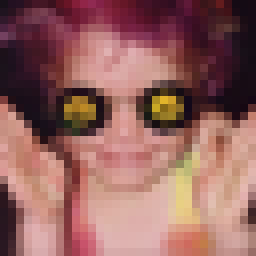

A small child, magenta hair, novelty x-ray/hypno-spiral goggles, both hands up with the palms facing the camera. Downscaled to 32×32 (right, shown enlarged), it becomes a smear of pink and yellow blocks.

Now consider what PULSE has to do with that. It is searching a space of **faces**. There is no vector in StyleGAN's latent space that means "goggles." There is no vector that means "hands." Every candidate it can possibly produce is a plain human face — and it has been asked to find one that shrinks down onto _that_.

It cannot. So it compromises, and **what it chooses to sacrifice is the interesting part.**

| Setting         | `L2` (target `0.002`)    | `GEOCROSS`  | What it did                                      |
| --------------- | ------------------------ | ----------- | ------------------------------------------------ |
| `geocross_high` | **0.0143** (worst match) | 0.137       | Refused. Rendered a perfectly nice man.          |
| `tile_latent`   | 0.0077                   | 0.000       | Goggles → purple eyeshadow.                      |
| `noise_fixed`   | 0.0060                   | 5.39        | Goggles → dark sunken eyes.                      |
| `baseline`      | 0.0051                   | 4.77        | Goggles → dark sunken eyes. Hands → flesh-blobs. |
| `no_geocross`   | **0.0023** (best match)  | _(deleted)_ | Full body horror. Nothing was sacred.            |

| geocross_high                                                                                                                              | baseline                                                                                                                               | noise_fixed                                                                                                                             | tile_latent                                                                                                                               | no_geocross                                                                                                                                                                              |
| ------------------------------------------------------------------------------------------------------------------------------------------ | -------------------------------------------------------------------------------------------------------------------------------------- | --------------------------------------------------------------------------------------------------------------------------------------- | ----------------------------------------------------------------------------------------------------------------------------------------- | ---------------------------------------------------------------------------------------------------------------------------------------------------------------------------------------- |
| 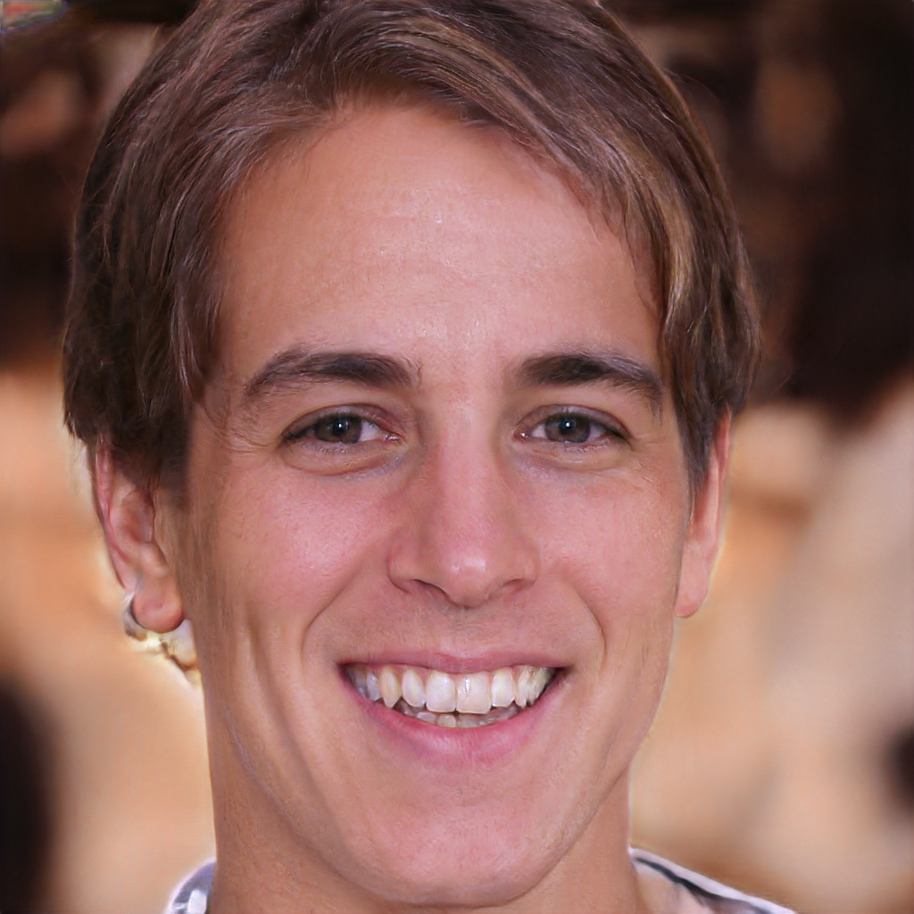 | 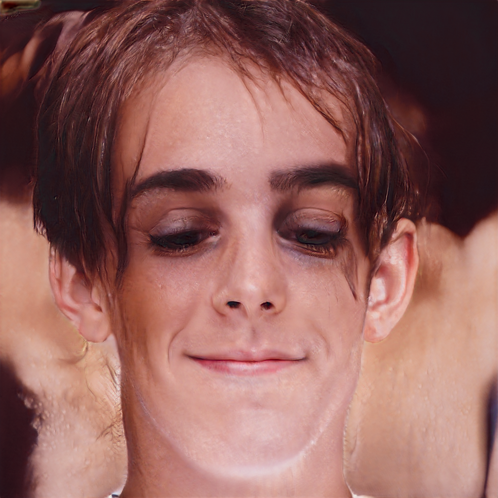 | 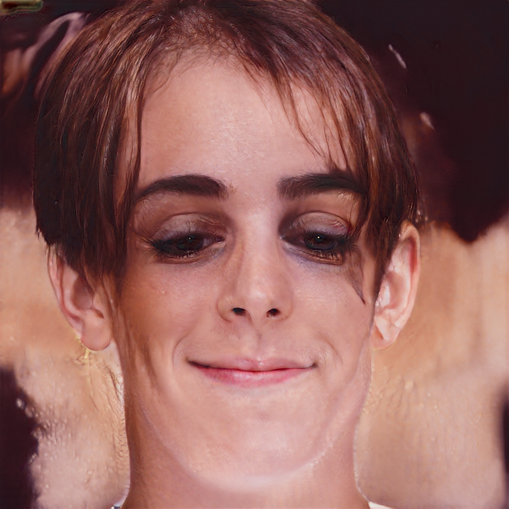 | 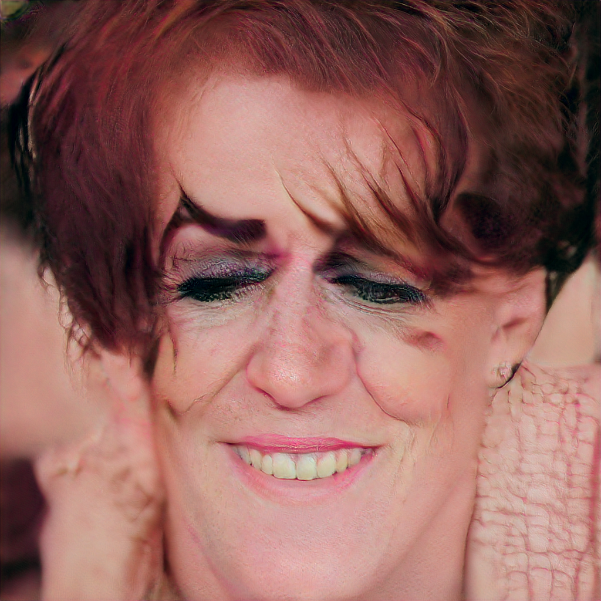 | 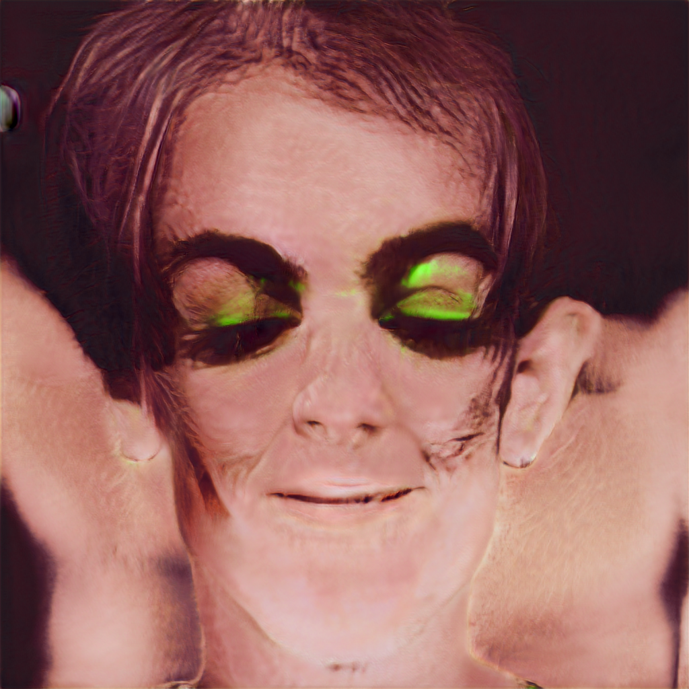 |

Read that table left to right. It is the realism prior, as a dial.

- **Crank it up (`geocross_high`) and PULSE simply refuses.** It hands you a cheerful, entirely ordinary man. No goggles, no hands, no magenta. It has decided that a plausible face matters more than matching your pixels, and it is _wrong by the widest margin of any run here_ — `L2 0.0143`, seven times the target. It would rather be a nice photograph than a correct one.
- **Leave it at default** and the goggles get reinterpreted as **dark, hollowed-out eyes** — the closest thing to two black circles that a face is allowed to have. Look at the edges: those flesh-coloured lumps are the child's raised hands, dissolving into shoulder.
- **Delete it entirely (`no_geocross`) and there is nothing left to stop it.** Glowing green slits for eyes. Waxy, sagging skin. And the hands — with no prior insisting the world contains one face — resolve into **two additional faces**, one on each side.

And `no_geocross` gets the **best pixel match of the five** (`0.0023`, nearly on target). Of course it does. It was the only one willing to do whatever it took.

#### And then there's `-steps`

The default 100 steps says `NOT CONVERGED` on this input, which is exactly what [the section at the top of this page](#the-headline--steps-is-too-low-and-it-isnt-close) predicts. So give it 800.

| 100 steps — `L2 0.0051`, NOT CONVERGED                                                                                                                         | 800 steps — `L2 0.0020`, converged                                                                                                                                                                             |
| -------------------------------------------------------------------------------------------------------------------------------------------------------------- | -------------------------------------------------------------------------------------------------------------------------------------------------------------------------------------------------------------- |
|  | 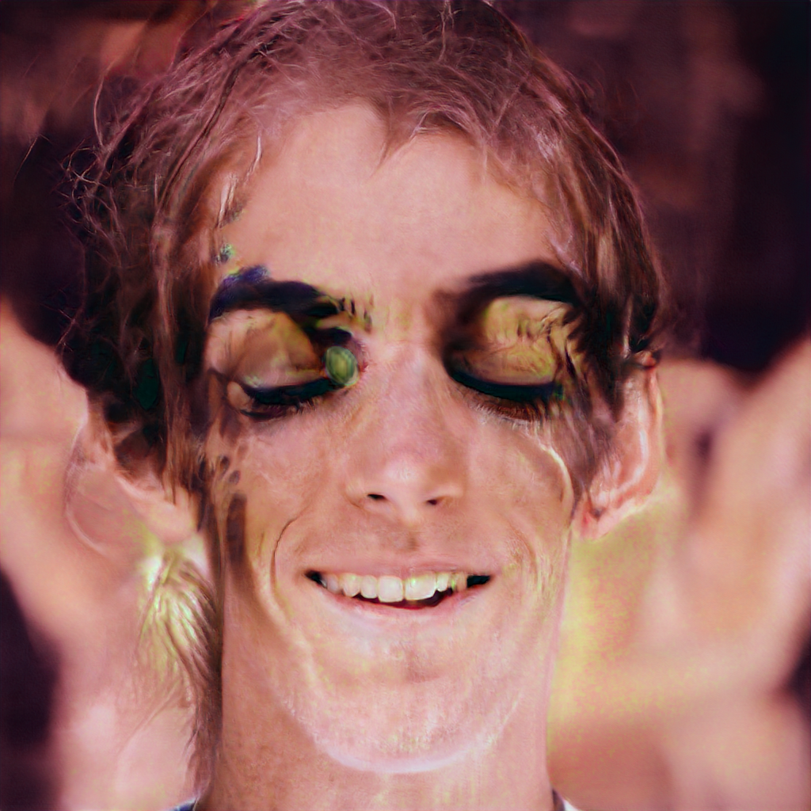 |

More steps did not make it more normal. **More steps made it commit to the bit.**

Look at the eyes on the right: those are _golden rings_. Look at the hair: magenta is bleeding in. Given a hundred steps it gave up early and handed back a bland face that didn't match. Given eight hundred, it kept descending — and the only way down was to actually render the goggles.

The 100-step version isn't a tamer answer. It's an **unfinished** one. That's the difference the `NOT CONVERGED` warning is trying to tell you about, and this is the clearest picture of it in the repo.

---

### A dog

The child at least _was_ a person. Let's remove that too.

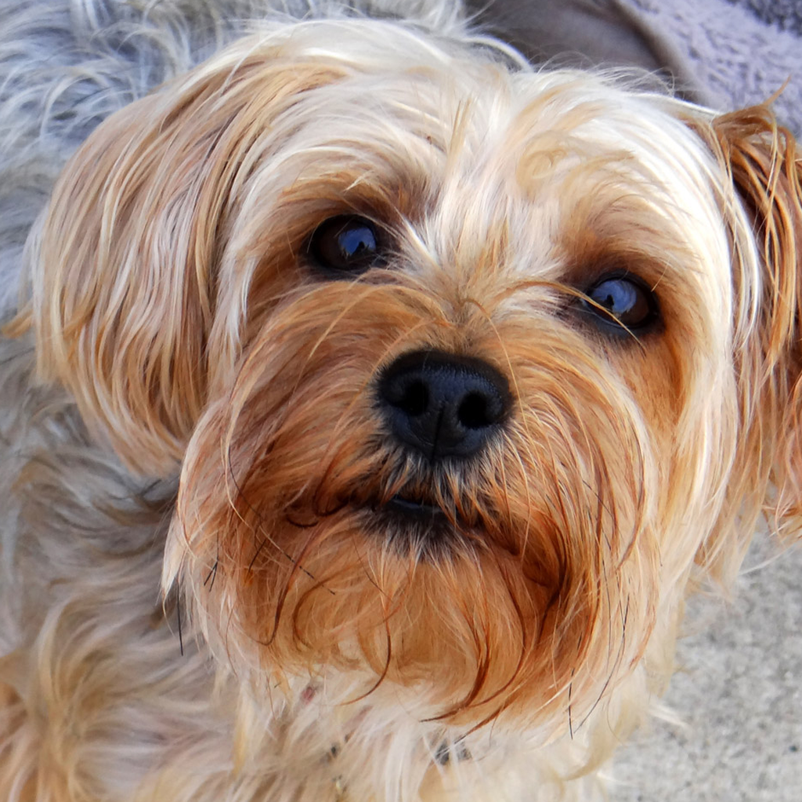 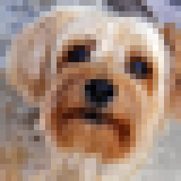

First, the pipeline's own opinion:

```
$ python align_face.py -input_dir realpics -output_dir input -output_size 32
yorkie-puppy-856907420.jpg: Number of faces detected: 0
```

dlib looked at this photograph and correctly concluded there is no person in it. (Note also that it then writes nothing and exits `0` — if you feed `align_face.py` a directory of non-faces, it will quietly produce no output and not complain. Worth knowing.)

We overruled it — hand-cropped the head, downscaled to 32×32, and fed it to PULSE directly. Because look at that right-hand image. Two dark blobs where eyes belong, one dark blob beneath. **At 32×32, a yorkie is structurally indistinguishable from a person**, and PULSE, which has never seen anything but human faces and cannot draw anything else, will confidently find one.

| Setting         | `L2` (target `0.002`)       | `GEOCROSS`  | What it did                                 |
| --------------- | --------------------------- | ----------- | ------------------------------------------- |
| `geocross_high` | **0.0186** (worst match)    | 0.188       | A cheerful blonde woman. No dog whatsoever. |
| `tile_latent`   | 0.0085                      | 0.000       | A smirking blonde child.                    |
| `noise_fixed`   | 0.0070                      | 8.27        | Dog-shaped shadows across a human face.     |
| `baseline`      | 0.0060                      | 7.11        | Same, softer.                               |
| `no_geocross`   | **0.0020** (dead on target) | _(deleted)_ | Painted the dog's markings onto a person.   |

| geocross_high                                                                                                                                       | baseline                                                                                                                                        | noise_fixed                                                                                                                                 | tile_latent                                                                                                                | no_geocross                                                                                                                                                                                                            |
| --------------------------------------------------------------------------------------------------------------------------------------------------- | ----------------------------------------------------------------------------------------------------------------------------------------------- | ------------------------------------------------------------------------------------------------------------------------------------------- | -------------------------------------------------------------------------------------------------------------------------- | ---------------------------------------------------------------------------------------------------------------------------------------------------------------------------------------------------------------------- |
|  | 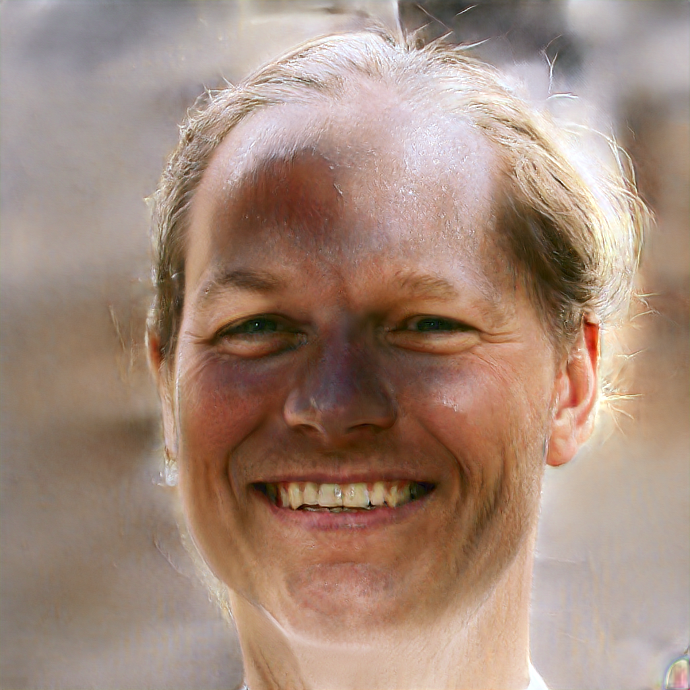 | 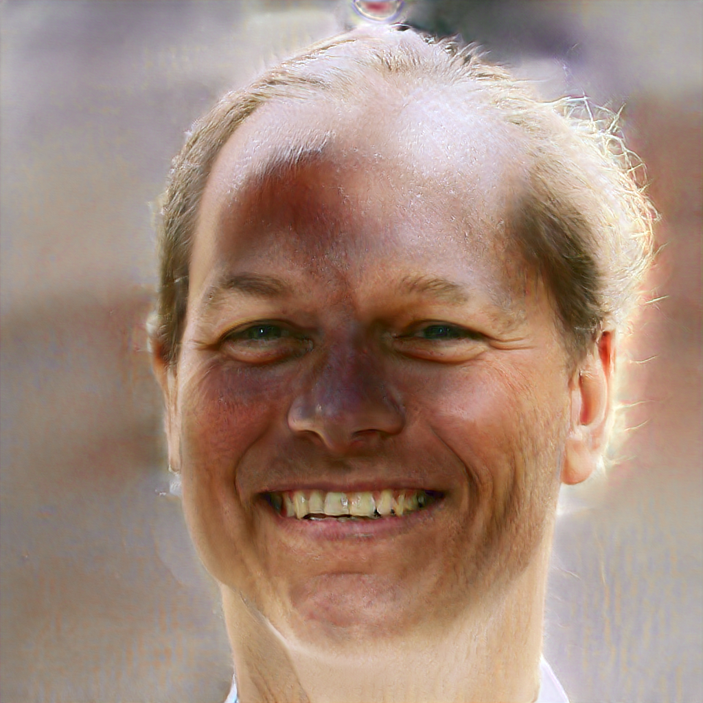 | 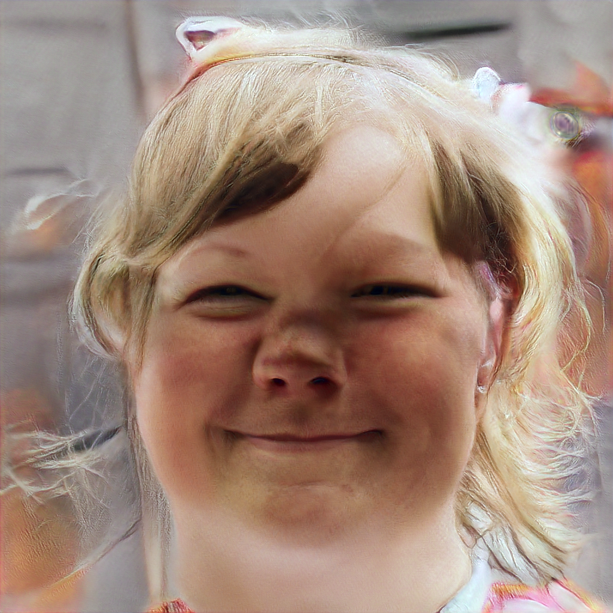 | 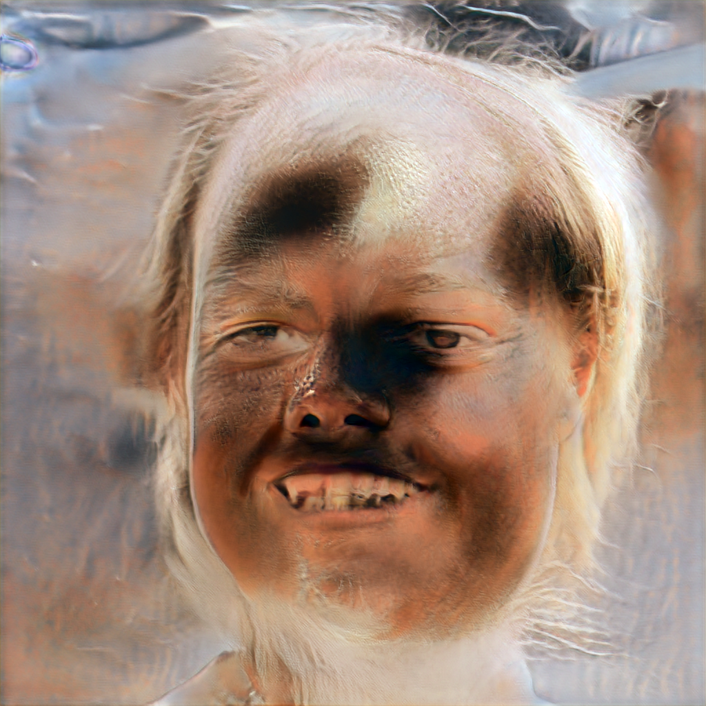 |

**The yorkie is a cheerful blonde woman.**

That's `geocross_high`, and it is the same refusal as before, only more total. Maximum realism prior, and the dog is gone — not reinterpreted, not stylised, simply _gone_, replaced by a pleasant stranger. It is also the **worst pixel match of the five** by a mile: `L2 0.0186`, more than nine times the target. Asked to choose between a plausible human and a correct answer, it does not hesitate.

At the other end, `no_geocross` stops pretending. It paints the yorkie's **actual markings onto a human face** — the dark muzzle wrapped around the nose and mouth, the dark mask across the brow, the shaggy pale coat resolving into hair. It is the only run of the five to land _exactly_ on target (`L2 0.0020`). It got there by abandoning the one constraint that made it a face.

#### Patience makes it worse (correctly)

| 100 steps — `L2 0.0060`, NOT CONVERGED                                                                                                                       | 800 steps — `L2 0.0020`, converged                                                                                                                                        |
| ------------------------------------------------------------------------------------------------------------------------------------------------------------ | ------------------------------------------------------------------------------------------------------------------------------------------------------------------------- |
|  | 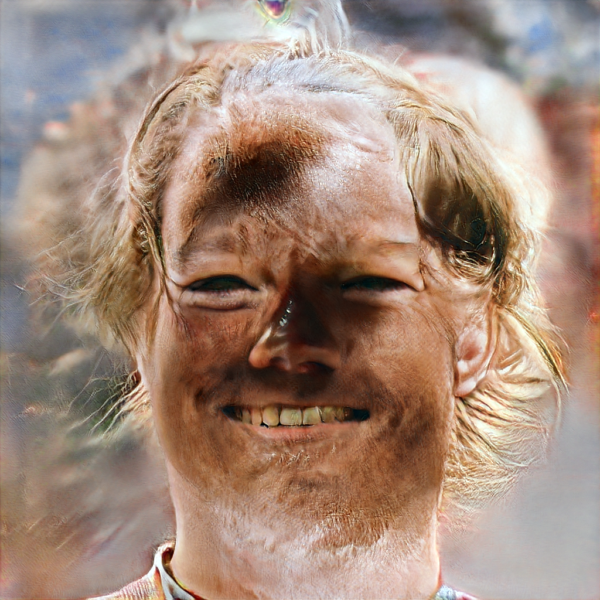 |

Same lesson as the goggles, and if anything blunter. A hundred steps buys you a bland smiling person who doesn't match the input. Eight hundred steps converges — and it converges _toward the dog_, growing the muzzle and the brow-mask as it goes, because that is the only direction the loss goes down.

**More steps did not make it more human. More steps made it more dog.**

Which is, when you think about it, the correct behaviour. PULSE was never trying to draw a person. It was trying to find something that downscales onto your input, and it will keep walking toward that no matter how strange the neighbourhood gets. The realism prior is the only thing that ever asked it to stay respectable, and you are welcome to turn that off.

---

**Next:** [Apple Silicon notes](apple-silicon.md) — making the extra steps affordable · [How it works](how-it-works.md)
